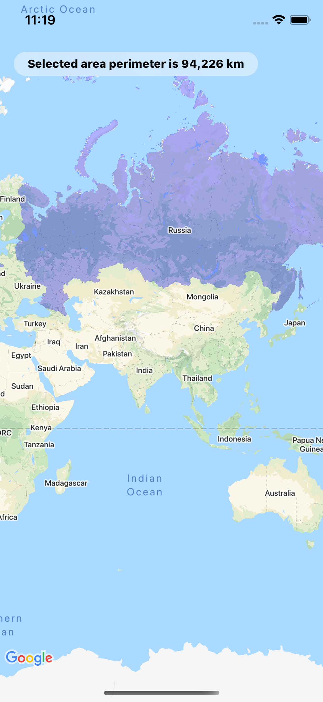

# WaadsuGeoJSONApp

Job application test app written in Swift, using SwiftUI, async/await, GoogleMaps (via CocoaPods) and GoogleMapsUtils (Swift Package).

There are three views showing `app state`: loading, error and map:

  
  
  

* App state is driven by `AppViewModel`,
* GoogleMapsView wraps `GMSMapView` as UIViewRepresentable,
* `AppDelegate` adaptor is used to initiate `GMSServices` (Google Maps),
* `Network Client` is injected as a dependency into the AppViewModel for testability,
* Entry point is `@main struct WaadsuGeoJSONAppApp: App`,
* `ContentView` switches on app state to present the corresponding view.

##

## Please be advised that API key would be reset 11.11.2021.

##  тестовое задание:

Передать запрос серверу на получение координат (https://waadsu.com/api/russia.geo.json )
данные в формате GeoJSON.

Получить список gps координат от сервера и отрисовать на карте в виде маршрута.
Посчитать длину маршрута по этим координатам.
И отрисовать ее там же на карте.

От вас:
Требуется исходный код для осуществления вышеперечисленных действий.
Добавьте побольше комментариев, чтобы мы могли понять лучше вашу логику
выбор карты и как ее отрисовать оставляем за вами.
Вы можете использовать гугл карты или яндекс карты, а также все чего как вам кажется не хватает - додумать самому. В этом задании всё уже есть - я никак не смогу помочь вам в выполнении. Требуемые языки указаны в вакансии)

Обратите внимание:
-Просим Вас выполнить задание до 4го ноября включительно, если вам нужно больше времени пожалуйста сообщите
-Готовое тестовое задание просим Выслать с ссылкой на гитхаб сюда 
-Обязательно укажите ссылочку на Ваше резюме именно на hh
